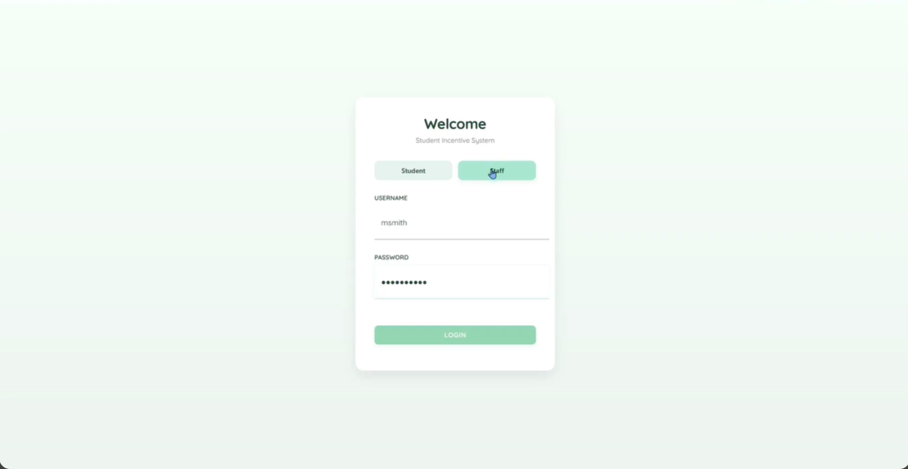
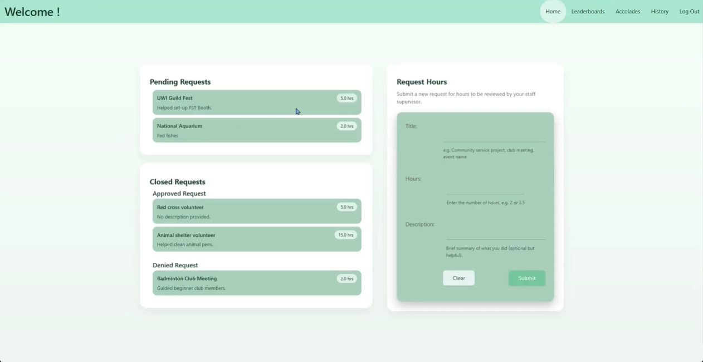
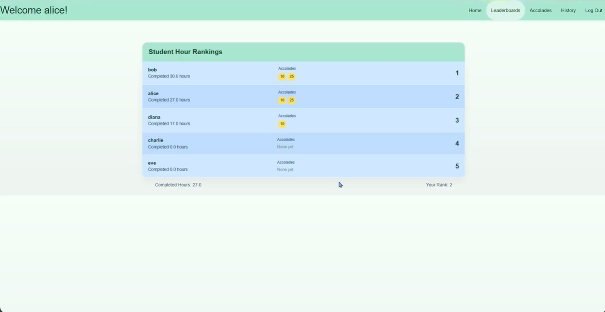
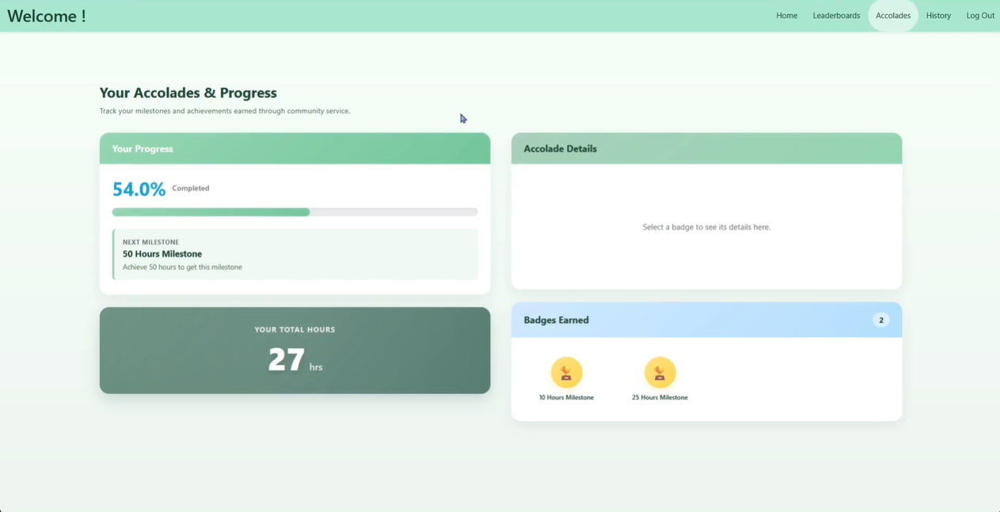
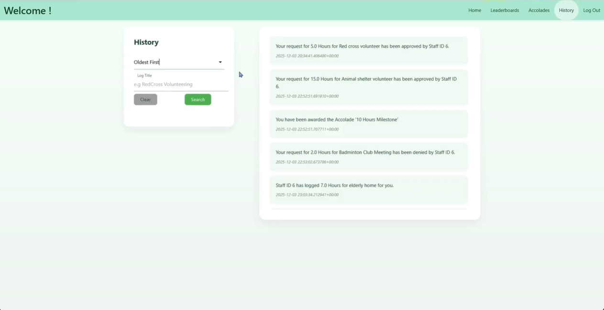
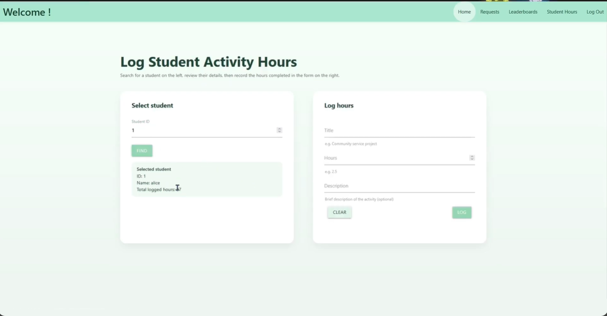
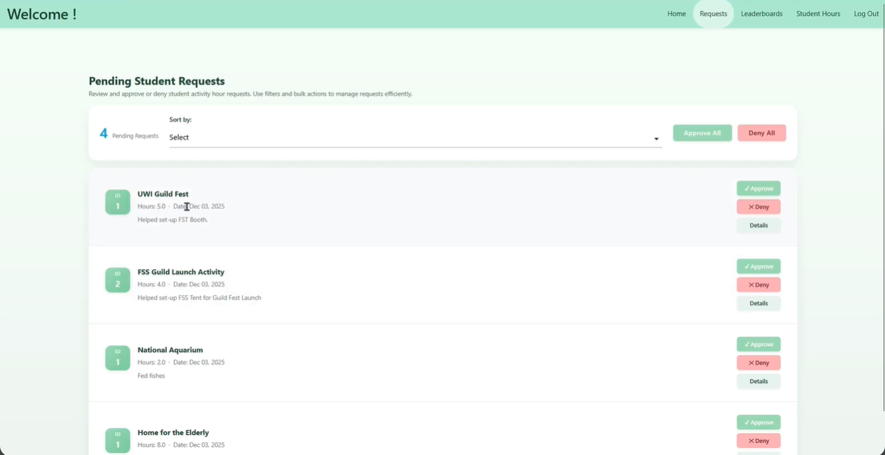
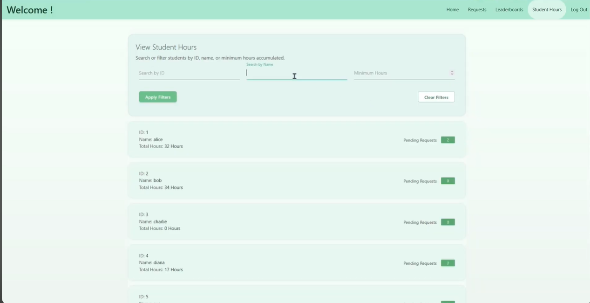

## Sample Screenshots

### Student Side

### Staff Side

---
## About the Student Incentive Platform

This platform helps tertiary institutions track and reward student participation by capturing volunteer or co-curricular hours, validating them through staff approvals, and converting approved time into accolades and leaderboard rankings. It is implemented with Flask and exposes both a command-line interface (CLI) for administrative tasks and lightweight web views for manual review and browsing.

Key capabilities:
- Student hour requests: students submit hours for confirmation.
- Staff review workflow: staff members can approve or deny requests; approvals automatically log hours.
- Accolades & leaderboards: students earn accolades and are ranked by approved hours.
- Reporting utilities: CLI commands to list users, staff, students, requests, and logged hours.

Interfaces:
- CLI: `flask` commands for initialization, user/staff/student management, and test execution.
- Web views: basic HTML templates and static assets for viewing lists, messages, and admin pages.

Intended users: administrators, staff reviewers, and students at educational institutions who need a simple system to record and validate participation hours.
## General App Commands

| Command | Description |
|---------|-------------|
| `flask init` | Creates and initializes the database |

---
## Tests

Run unit and integration tests via the Flask CLI testing command. Example commands:

- `flask test int` — or - `flask test unit` runs the integration tests or unit tests respectively.
---
